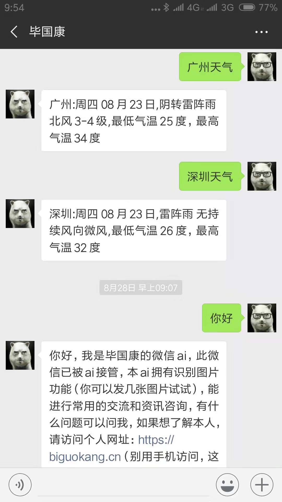
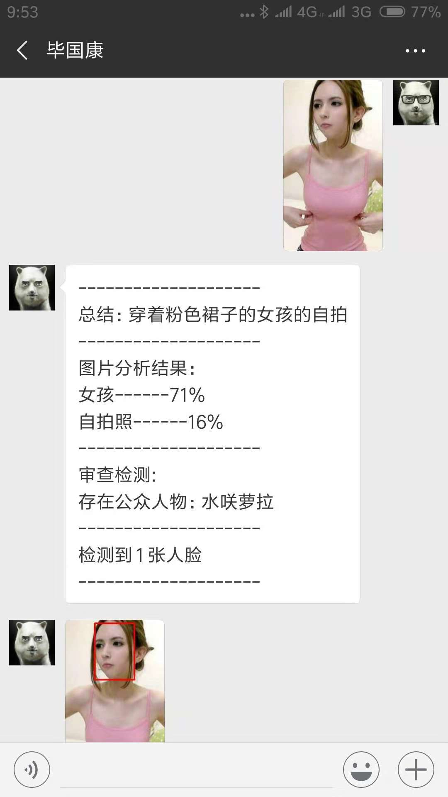
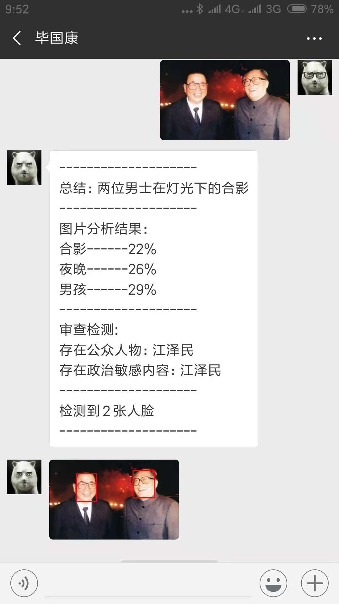
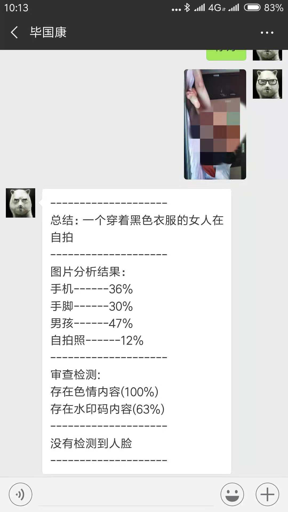

硬广植入：本人自己搭建了个git代码托管服务器，各位大佬可以在我的git服务器里建立免费的私有库，也可以作为备用代码储存点，毕竟github总是会出问题的，本git服务器架设在华为云的广州节点上，git代码托管地址如下：
http://gayhub.fun (ps.本人不是基佬)

---

# 项目简介
本项目是我调用了百度ai开发平台和腾讯ai开发平台的人工智能api接口实现的智能微信ai，此ai可以和你聊天（类siri功能），也拥有图片识别功能

# 演示介绍
#### 聊天功能

#### 公众人物识别功能

#### 政治敏感检测

#### 黄图检测功能(原图并未打码，不想再GitHub教坏小朋友)

# 安装与使用方法

### 最简单的方法

1. 把wx.py文件下载下来，确保你的py环境装了python3.5以上
2. 打开命令行界面，运行python wx.py命令
3. 之后你的命令行界面就会显示出二维码，用你的微信号扫码登陆即可，此时你的微信就会变成智能ai

### 建议你们使用的方法

因为上面你们是直接用的我的源码，所以很多服务用的是我自己的api key，而一些应用的api key只能每天免费调用1000次，所以我希望你们自己去申请自己的api key，教程在后面

# 项目的功能和相关依赖介绍
- 聊天功能： 图灵机器人api
- 总结： 腾讯ai开放平台
- 图片分析结果： 腾讯ai开放平台
- 审查检测： 百度ai开放平台
- 人脸检测： 腾讯ai开放平台
- 人脸画框功能： opencv